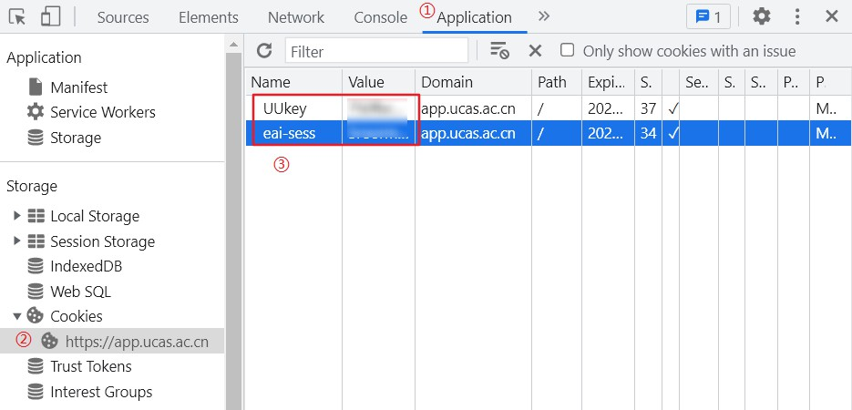

# ucas_cronavirus_report

适用于国科大企业微信平台的疫情每日打卡脚本。

原理是基于上次打卡记录构造本次打卡记录，因此仅适用于无异常情况时的打卡，如打卡信息有变动请手动打卡。

**注意：**

由于脚本需要登录到sep系统，（只会在本地）用明文存储用户名和密码。

如果担心安全问题或无法正常登录，也提供了使用cookies登陆的方法，请使用`report_cookies`。

配置cookies的方法见[获取cookies](#获取cookies)。

## 目录

1. [运行脚本](#运行脚本)
2. [用户信息配置](#用户信息配置)
3. [实现自动化](#实现自动化)

## 运行脚本

### 用可执行文件运行

本脚本已打包成exe可执行程序，请在[releases](https://github.com/barryZZJ/ucas_cronavirus_report/releases)页面下载。

### 用python3运行
1. 配置环境

   ```
   pip install requests
   pip install easydict
   ```

2. - 运行入口脚本（用户名密码登录）

     ```
     python3 report.py
     ```

   - 运行入口脚本（cookies登录）

     ```
     python3 report_cookies.py
     ```

## 用户信息配置

首次运行时会要求输入sep系统用户名和密码（或cookies），并生成ini配置文件。

如果不小心输入了信息，可以修改`user.ini`（或`user_cookies.ini`）中的信息，或直接删除ini文件，重新运行脚本。

### 获取cookies

打卡系统需要`eai-sess`和`UUKey`两个cookie。

可以[使用抓包软件获取](#抓包软件获取cookies)，或[从浏览器中获取](从浏览器获取cookies)。

#### 抓包软件获取cookies

1. 安装抓包软件：我使用的是[fiddler classic](https://www.telerik.com/fiddler)，安装与使用教程请自行上网搜索，注意需要安装证书才能抓取https报文。（如果觉得麻烦可以直接跳到[手动获取cookies](#手动获取cookies)）

2. - 电脑端：用浏览器打开https://app.ucas.ac.cn/uc/wap/login，抓取登录时的POST报文，既可获得两个cookie。如图：

   

   

   - 手机端：参考[这篇博客](https://www.cnblogs.com/mmz-tester/p/11125007.html)配置好PC端和手机端后，在手机上点开国科大企业微信——A疫情防控，然后随便找一个域名是`app.ucas.ac.cn`的报文，就能看到所需的cookie了。如图：

     


#### 从浏览器获取cookies
使用浏览器打开https://app.ucas.ac.cn/uc/wap/login，登录后在开发者工具里找到cookie。

以Chrome为例，按下F12后，Application——左侧找到Cookies下拉菜单——选择ucas的域名。如图：




## 实现自动化
### Windows
任务计划程序。可参考[Windows创建定时任务执行Python脚本](https://blog.csdn.net/u012849872/article/details/82719372)。

### Linux
使用`crontab`。可参考[Linux crontab 命令](https://www.runoob.com/linux/linux-comm-crontab.html)。

示例：每天早上8点运行脚本：

`0 8 * * * python3 report.py`
